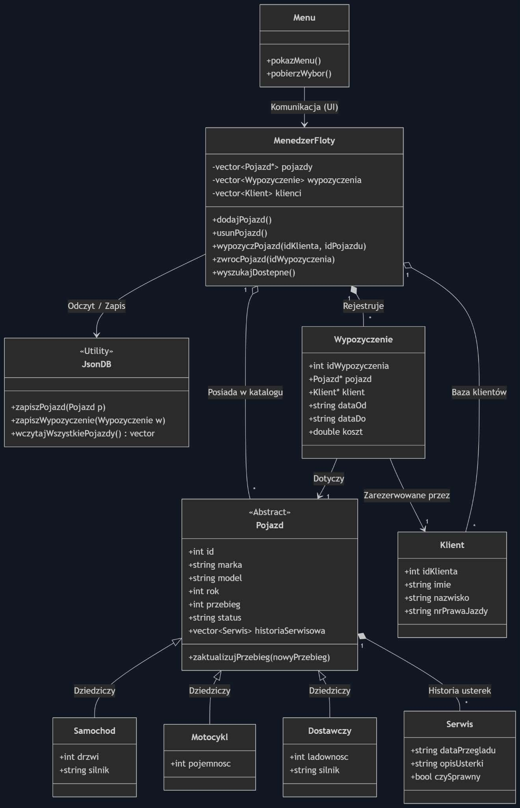
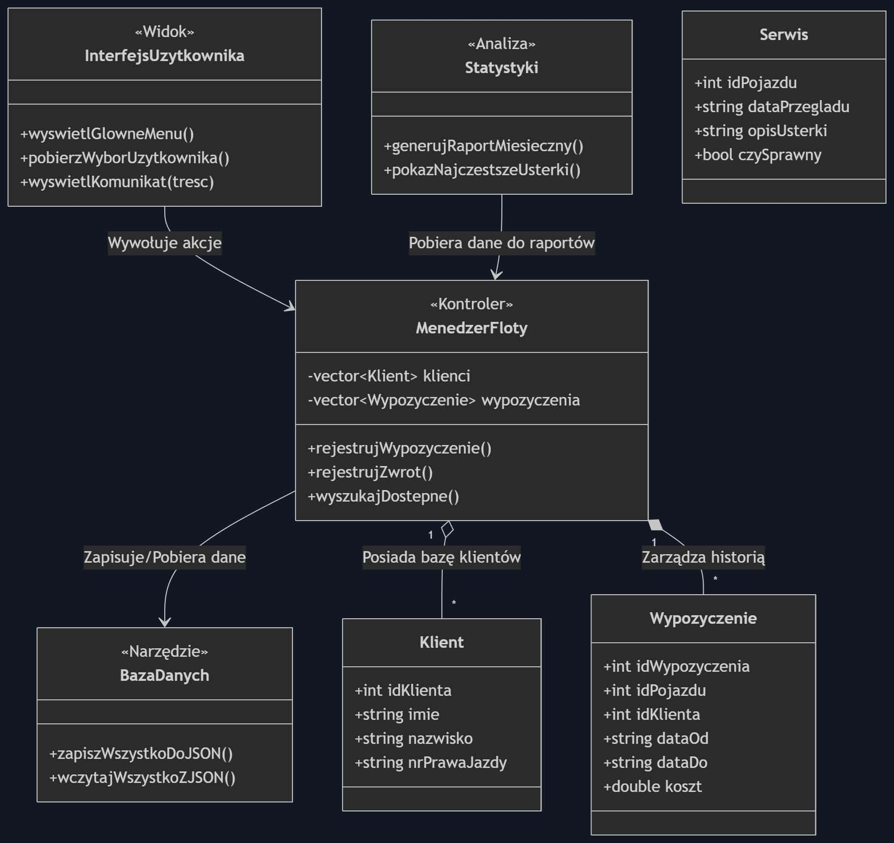

# Wypożyczalnia samochodów
Projekt zaliczeniowy C++
Temat 5: System zarządzania flotą samochodów (wypożyczalnia)

# Diagram

# Do it list:
https://trello.com/b/jQH2vFsK/pojazdy

# Opis projektu
Konsolowy system zarządzania flotą pojazdów napisany w C++. Umożliwia kompleksową obsługę wypożyczalni — od rejestracji pojazdów i klientów, po zarządzanie wypożyczeniami i historią serwisową.

# Funkcjonalności
Zarządzanie pojazdami

Dodawanie i usuwanie pojazdów trzech typów: samochód, motocykl, pojazd dostawczy  
Śledzenie statusu pojazdu: dostępny / wypożyczony / serwis  
Aktualizacja przebiegu z walidacją (nowy przebieg musi być wyższy od aktualnego)  
Historia serwisowa z opisem usterek  

Zarządzanie klientami

Rejestracja klientów z danymi osobowymi i numerem prawa jazdy  
Wyszukiwanie klientów po ID

Wypożyczenia

Rejestrowanie nowych wypożyczeń z datami i kosztem  
Zwrot pojazdu — automatyczna zmiana statusu na dostępny  
Zabezpieczenia przed wypożyczeniem niedostępnego pojazdu lub usunięciem wypożyczonego  

Statystyki

Raport wszystkich wypożyczeń z podsumowaniem przychodów  
Zestawienie najczęstszych usterek w historii serwisowej  

# Skład zespołu:
Igor Rudziński  
Patryk Bogdał  
Patryk Malarz  
Jakub Sołtys  

