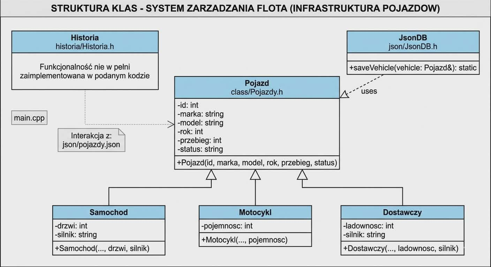

# Wypożyczalnia samochodów
Projekt zaliczeniowy C++
Temat 5: System zarządzania flotą samochodów (wypożyczalnia)

# Diagram

# Do it list:
https://trello.com/b/jQH2vFsK/pojazdy

# Skład zespołu:
Igor Rudziński
Patryk Bogdał
Patryk Malarz
Jakub Sołtys
